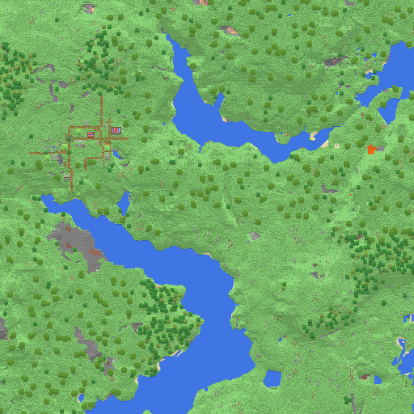
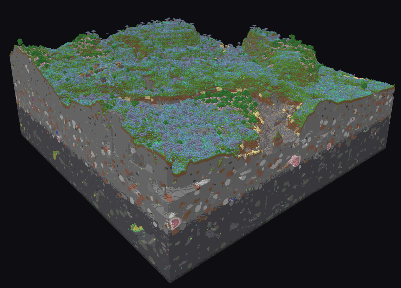

# MinecraftWorldViews

High-efficiency, browser-native voxel rendering engine for Minecraft worlds.

**Core philosophy:** maximal efficiency. Typed arrays over object graphs, zero-copy views over
allocation, Web Workers over main-thread work. The main thread is reserved for UI and WebGL
draw calls.

## Screenshots


*The 2D region inspector (`index.html`) — top-down terrain map with hillshading.*


*The 3D viewer (`viewer.html`) — greedy-meshed chunks rendered in WebGL.*

## Roadmap status

| Phase | Scope | Status |
| ----- | ----- | ------ |
| 1. I/O & decompression | Stream `.mca` region files, ranged reads, native `DecompressionStream`, worker pool | ya |
| 2. NBT & blockstates | Lazy NBT parser, bit-packed palette extraction | kinda |
| 3. Geometry & meshing | Greedy meshing + internal-face & transparency culling | ya |
| 4. WebGL rendering | WebGL2, per-chunk buffers, frustum culling, texture-array textures + mipmaps | kinda |

## Architecture

```
index.html                 2D region inspector — just open it in a browser
viewer.html                3D region viewer (WebGL) — open it in a browser
src/
  index.ts                 Public API
  io/
    byte-source.ts         ByteSource interface — random-access byte ranges
    blob-source.ts         Local files via Blob.slice (no full-file load)
    http-range-source.ts   Remote files via HTTP Range requests
    memory-source.ts       In-memory buffers (tests, small files)
    region-file.ts         Anvil (.mca) parser — header tables in Uint32Arrays,
                           chunks fetched lazily one ranged read at a time
    compression.ts         Native DecompressionStream (gzip/zlib) wrapper
  nbt/
    reader.ts              Forward-only NBT cursor; skips unwanted branches
                           with pointer arithmetic, zero allocation
    chunk.ts               Lazy chunk parser — reads only sections/palettes/
                           blockstates, ignores entities, lighting, ticks
    bit-packing.ts         1.16+ packed-index unpacking via 32-bit halves
  mesh/
    block-model.ts         Per-palette block classification (empty/opaque/
                           transparent) + block colors
    voxel-grid.ts          Flattens a chunk's sections into one padded id grid
                           so the mesher reads neighbours with no bounds checks
    greedy-mesher.ts       Greedy meshing: merges coplanar same-block faces
                           into maximal quads, culls hidden internal faces,
                           emits flat Float32/Int8/Uint8/Uint32 arrays
  worker/
    pool.ts                Generic Web Worker pool (transfer-based, FIFO queue)
    region-worker.ts       Off-thread chunk decompression + parsing
    region-pool.ts         Pool-backed decompress/parse pipeline factory
test/                      Vitest suite with synthetic region files & NBT
```

### Efficiency notes

- **No full-file loads.** `RegionFile.open()` reads only the 8 KiB header; each chunk costs
  exactly one ranged read of its sectors. Works the same over `Blob.slice` and HTTP `Range`.
- **Flat data.** Location/timestamp tables live in two `Uint32Array`s; chunk payloads are
  zero-copy `subarray` views into the sector read.
- **Lazy NBT.** The parser never builds a tag tree. Unwanted branches (entities, heightmaps,
  lighting, tick queues) are skipped with pure pointer arithmetic; packed blockstates are
  unpacked straight out of the NBT buffer into one `Uint16Array` per section.
- **No BigInt on the hot path.** Packed 64-bit longs are processed as pairs of 32-bit halves
  with plain integer ops (entries never span longs in the 1.16+ format).
- **Off-thread everything.** `createRegionWorkerPool()` decompresses *and* parses in workers;
  payloads move via transfer lists (never structured-clone copies) and section arrays are
  transferred back.
- **Greedy meshing, pure JS.** Each chunk's sections flatten into one padded `Uint16Array`
  of block ids; the mesher sweeps the six face directions, builds a per-slice mask, and
  merges adjacent same-block coplanar faces into maximal quads. Internal faces and faces
  hidden by opaque neighbours are culled; same-material transparent faces are culled too,
  so a block of glass doesn't z-fight with itself. Output is exactly-sized flat typed
  arrays (`Float32Array` positions, `Int8Array` normals, `Uint8Array` RGBA, `Float32Array`
  tiling UVs, `Uint32Array` indices) — upload-ready with no further JS. No Wasm, so it
  still runs straight from disk.
- **Frustum-culled draw.** Each chunk uploads to its own static WebGL2 buffers (one VAO)
  once; a per-frame bounding-sphere test against the view-frustum planes skips off-screen
  chunks. Face shading is baked into vertex alpha, so the fragment shader does no lighting.
- **Texture array, not an atlas.** Block textures load into one `TEXTURE_2D_ARRAY` (one
  layer per block type), so the whole region draws with a single texture bind and no
  per-tile UV math. Greedy-merged quads carry UVs that run 0..width / 0..height, so a
  `REPEAT` wrap tiles each block's texture instead of stretching one copy across the merged
  face — the reason an atlas wouldn't work here.
- **Level-of-detail textures.** The texture array is mipmapped, so a far-off block samples
  a low-res mip automatically (no aliasing shimmer, a fraction of the texture bandwidth)
  while a block up close samples the full-resolution base level. Filtering is
  `NEAREST_MIPMAP_NEAREST` + `NEAREST` mag, so each mip stays pixel-crisp instead of
  blurring two mips together up close. The array is built at the *pack's* native tile size
  (16/32/64px, capped at 128), detected from its first block texture — so a hi-res pack
  keeps its detail when you get close instead of being downscaled to 16px. (Anisotropic
  filtering is enabled where the driver supports it.)

## Usage

```ts
import { BlobSource, RegionFile, createRegionWorkerPool, isAirState, blockIndex } from 'minecraft-world-views';

const pool = createRegionWorkerPool();
const region = await RegionFile.open(new BlobSource(file), { decompress: pool.decompress });

for (const { x, z } of region.chunks()) {
  const raw = await region.readRawChunk(x, z);
  const chunk = await pool.parse(raw.compressionType, raw.payload); // off-thread
  for (const section of chunk.sections) {
    // section.palette: BlockState[]; section.blocks: Uint16Array of palette
    // indices in YZX order (null = whole section is palette[0])
    const state = section.palette[section.blocks?.[blockIndex(0, 0, 0)] ?? 0];
  }
}
```

Supports worlds from Minecraft 1.16 onwards (1.18+ `sections` layout and the older
`Level.Sections` layout).

To turn a parsed chunk into WebGL-ready geometry, hand it to `meshChunk`:

```ts
import { meshChunk } from 'minecraft-world-views';

const mesh = meshChunk(chunk); // null if the chunk has no renderable blocks
if (mesh) {
  // mesh.positions: Float32Array  (x,y,z per vertex; add chunk.x*16 / chunk.z*16)
  // mesh.normals:   Int8Array     (axis-aligned face normal per vertex)
  // mesh.colors:    Uint8Array    (r,g,b,a; alpha is baked face shading)
  // mesh.uvs:       Float32Array  (u,v; 0..w / 0..h so a per-block texture tiles)
  // mesh.indices:   Uint32Array   (two triangles per quad)
  gl.bufferData(gl.ARRAY_BUFFER, mesh.positions, gl.STATIC_DRAW);
}
```

## Running it

Download or clone the repo and open one of the two pages in a browser. No install,
no build, no server.

- **`index.html` — 2D map.** Pick an `.mca` file and it renders a top-down terrain map
  of the region, one pixel per block, with map-style hillshading. Scroll to zoom (anchored
  at the cursor), drag to pan, double-click to reset, and click anywhere to identify the
  surface block and its height.
- **`viewer.html` — 3D view.** Pick an `.mca` file and it greedy-meshes every chunk and
  renders the region in WebGL2. Drag to orbit, scroll to zoom, right-drag / Ctrl-drag / WASD
  to pan, and press R to reset the camera. For real block textures, also pick a **resource pack**
  (`.zip`/`.jar`) with the "textures" picker — it's read in-browser and textures every
  block type it has art for; blocks it doesn't fall back to a flat color. Without a pack,
  everything renders in flat colors.

(Both pages inline the Phase 1-3 pipeline as a classic script because browsers block ES
module imports and Web Workers on pages opened from disk. WebGL itself has no such
restriction. The importable library in `src/` is the same logic, plus the worker pool,
for embedding in real apps.)

## Development

Only needed if you want to run the test suite or build the library package:

```sh
npm install
npm test           # vitest
npm run typecheck  # tsc --noEmit
npm run build      # emit dist/ with declarations
```
